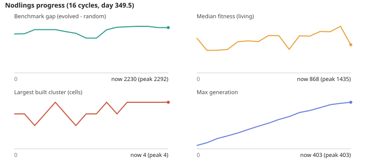

# Nodlings

An observational A-Life terrarium. Open `index.html` in a browser — no build, no dependencies.

## Files

| File | Role |
|------|------|
| `brain.js` | Evolving neural network (NEAT-style topology + weight evolution) with reward-modulated Hebbian plasticity, plus heritable cosmetic (sprite) genes |
| `world.js` | 128×96 grid, property-based materials + loot tables, lakes, seasons, day/night temperature, seed germination, spatial index |
| `nodling.js` | Needs (energy/hydration/temperature), senses, brain→physics wiring, hunting, reproduction, data-fueled self-rewriting |
| `critters.js` | Neutral wildlife (scripted): graze flora, flee Nodlings, breed, drop meat |
| `predators.js` | Predators with their own evolving brains — an arms race vs. Nodling evasion |
| `observer.js` | Automated analyst: reads the world once per in-world day, logs milestones/issues/trends, exportable as markdown |
| `sprites.js` | Procedural pixel-art creatures (from genes), critters, terrain and material tiles |
| `render.js` | Camera (pan/zoom), viewport culling, minimap, seasonal/night tint, hover tooltip, click-to-follow |
| `main.js` | Tick loop, hall of fame, sidebar stats, population sparkline, reset, self-test |

## How emergence works here

- **No behavior is scripted.** A Nodling's brain is an evolving neural network (49 sensory inputs → 9 motor outputs) with NEAT-style topology growth, reward-modulated plasticity, **gated memory neurons** (longer-horizon state), a **curiosity** drive (intrinsic reward for novelty, to speed discovery), and a **plasticity surge** when it eats `data` (fast learning for a while). The base reward is survival + reproduction.
- **Predators evolve too.** Predators run their own smaller evolving brains with their own hall of fame, so an **arms race** develops — they learn to hunt while Nodlings learn to evade. Predation also creates safety-in-numbers pressure (a driver toward flocking/tribes).
- **Senses include** vision, proprioception, spatial memory (where food/water/shelter/fire was), predator threat, a neighbour's health + kinship + **last action** (so imitation can be learned), and fire.
- **Emergence via affordances, not recipes.** New behaviors are only discoverable if the *physics* make them possible — never a crafting menu. Examples: striking wood works it into a **plank**; **fire** (dry-season ignition) spreads, cooks meat into higher-energy food, fires **clay into brick** (a kiln), and is a heat source to shelter beside; **fiber** (from flora) binds a stack so it resists being knocked down; breeding inside a **nest** (structure cluster) gives newborns a head start.
- **Life cycle:** juveniles see less and can't breed; old age raises upkeep (senescence).
- **Diet niches:** an evolved gene runs herbivore↔carnivore. Herbivores get more from plants, carnivores from meat — so the population splits into a food web that raises carrying capacity and diversity.
- **A stable ecology, on purpose.** Winter is a lean cool season rather than a mass-killer, so the population is limited by *food competition* (carrying capacity), not seasonal die-offs. This matters: a stable population near capacity rewards being smarter than your neighbour (K-selection), whereas boom-bust cycles just reward breeding fast (r-selection) and stall evolution. Instead of dumping clones at near-extinction, a gentle "life-support" trickles in diverse gene-bank Nodlings that keep their lineage depth — so generations accumulate (100s deep) instead of resetting.
- **A continent, not a grid.** The world is a landmass ringed by ocean. Nodlings **can't swim** — water is a hard barrier — so they expand by **building bridges** (dropping buoyant wood/plank onto adjacent water makes a walkable tile). Predators and critters can't cross water at all, so islands and bridged areas are refuges.
- **Fire** is tuned subcritical: it burns a patch and dies out rather than wiping the map, and **water/stone act as firebreaks**. It's a real hazard (and heat source, and kiln) without being a reset.

## The Observer

An automated analyst (`observer.js`) does the "watch and report" job for you. Once per in-world day it reads the whole world and appends **milestones** (first brick, first bridge, generation/fitness thresholds, predators learning to hunt), **issues** (near-extinction, fire damage, no construction), and **trends** (fitness climbing, brains shrinking, Nodlings grouping into proto-tribes) to a log. Open it with the **Observations** button; download it as markdown for later. It has caught real emergent events in testing — e.g. flocking (mean spacing collapsing) as a response to predators.
- **They also learn within a lifetime.** Synapses flagged plastic update by a reward-modulated Hebbian rule (reward = change in well-being + reproduction), so a Nodling is born with evolved instincts *and* adapts to its own experience. Recurrent connections give it evolvable memory.
- **Progress is auto-saved.** The hall of fame (the evolved genomes) is written to `localStorage` every 8 seconds and on close, and restored on load — so evolution resumes across reloads. Export/Import buttons make a portable JSON backup.
- **Physics, not recipes.** Materials are property bags (`weight`, `buoyant`, `insulation`, `nutrition`, optional `drops`). Stacked materials insulate nearby cells toward a comfortable 18°; height ≥ 3 blocks movement. "Shelter" is discoverable, not defined.
- **Seasons create the pressure.** A 32-day year swings from ~28° summer to below-freezing winter. Cold outside 0–38° carries a rising per-tick death chance, so shelter has real survival value — the fitness gradient that *could* drive building.
- **Food loop.** Eating flora can drop a **seed**; seeds germinate into new flora (plant it and you farm). Critters convert flora into **meat** when hunted; corpses drop meat too (scavenging). A wind-blown-flora safety net means food can't permanently hit zero.
- **Broken mutations don't crash** — a tree returning NaN "glitches" and drains energy, so buggy genomes select themselves out.
- **Data nodes** trigger `selfRewrite()`: a hard in-place mutation of one output tree during the Nodling's lifetime.
- **Sound** is a raw frequency channel in/out ("glowing" halos on-screen). Any meaning must be evolved.
- Near-extinction reseeds from a hall of fame of the best genomes ever, so evolution ratchets across die-offs.

## Vitals

Ideal body temp 18°. Comfortable 10–26° (outside drains energy); below 0° or above 38° has a rising per-tick death chance. Energy or hydration hitting 0 is fatal. Body temp tracks the local cell, which shelter warms.

## Interacting

Drag to pan, scroll to zoom, click a Nodling to follow it (click again to release), click empty ground to drop the selected material. The minimap recenters the camera; hover anything for a tooltip; every sidebar metric has a `?`. Reset spins up a fresh world.

## Known ceiling

Genuine multi-step construction (visible villages) is still a long evolutionary climb — but the pieces that make it *possible* are now in place: the environment rewards shelter, brains can grow arbitrary structure (NEAT) and adapt within life (plasticity), and progress persists so runs can accumulate over days of wall-clock time. Leave it running (or at 40×) and watch `best fitness` and `avg brain` climb. The `simTick()` boundary is clean for moving brains onto a Web Worker if you later want hundreds of Nodlings.

## The autonomous loop

`loop/` holds an unattended improvement loop (rules in `loop/RULES.md`, history in `loop/CHANGELOG.md`). It resumes one continuous world (`loop/world.json.gz`) each cycle and charts progress in `loop/progress.svg`:

The headline number is `benchmark.gap`: how much better the evolved gene pool does than random genomes on fixed-seed worlds. `node loop/run-headless.js --dry --ticks=2000` runs a throwaway batch; `node loop/ci-check.js` is the CI gate.

**Watching it:** open `index.html` and press **👁 Loop world** to load the loop's saved world (fetches `loop/world.json.gz` when served over http, otherwise asks for the file). `loop/dashboard.html` is a self-contained progress page rebuilt every cycle; `node loop/plateau.js` says when the loop should switch from tuning to structural changes.
